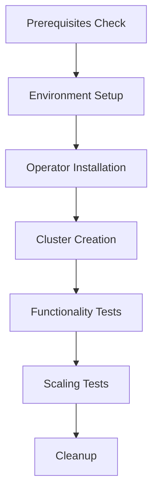

# Fukurow E2E Tests

This directory contains end-to-end (E2E) test scripts for Fukurow components.

## Kubernetes Operator E2E Test

The `test-k8s-operator.sh` script performs comprehensive testing of the Fukurow Kubernetes operator including:

### Prerequisites

- `kubectl` configured to access a Kubernetes cluster
- `docker` for building container images (if using kind/minikube)
- `curl` for HTTP endpoint testing

### Test Coverage

1. **Prerequisites Check**: Validates required tools and cluster connectivity
2. **Environment Setup**: Creates test namespace and loads required images
3. **Operator Installation**: Deploys CRD, RBAC, and operator components
4. **Cluster Creation**: Tests FukurowCluster custom resource creation
5. **Functionality Testing**: Validates health checks and API endpoints
6. **Scaling Tests**: Tests horizontal pod autoscaling functionality

### Usage

```bash
# Run all tests with default settings
./scripts/e2e/test-k8s-operator.sh

# Run with custom namespace
NAMESPACE=my-test-namespace ./scripts/e2e/test-k8s-operator.sh

# Run with custom cluster name and timeout
CLUSTER_NAME=my-cluster TIMEOUT=1200 ./scripts/e2e/test-k8s-operator.sh
```

### Environment Variables

- `NAMESPACE`: Test namespace (default: `fukurow-test`)
- `CLUSTER_NAME`: Name for test cluster (default: `test-cluster`)
- `TIMEOUT`: Maximum test execution time in seconds (default: `600`)

### Supported Clusters

- **kind**: Local Kubernetes cluster using kind
- **minikube**: Local Kubernetes cluster using minikube
- **Cloud clusters**: AWS EKS, Google GKE, Azure AKS, etc.

### Test Flow



### Troubleshooting

**Common Issues:**

1. **Image Loading**: Ensure Docker is running and accessible
2. **RBAC Permissions**: Test cluster may need additional permissions
3. **Resource Constraints**: Increase cluster resources for larger deployments
4. **Network Policies**: Some clusters have restrictive network policies

**Debug Commands:**

```bash
# Check operator logs
kubectl logs -n fukurow-test deployment/fukurow-operator

# Check cluster status
kubectl describe fukurowcluster test-cluster -n fukurow-test

# Check pod status
kubectl get pods -n fukurow-test

# Port forward for manual testing
kubectl port-forward -n fukurow-test svc/test-cluster-service 3000:3000
```

### Adding New Tests

To add new E2E test scenarios:

1. Create a new shell script in this directory
2. Follow the existing pattern with setup/cleanup phases
3. Add proper error handling and timeouts
4. Update this README with new test documentation

### CI/CD Integration

These tests can be integrated into CI/CD pipelines:

```yaml
# GitHub Actions example
- name: Run E2E Tests
  run: |
    kind create cluster
    ./scripts/e2e/test-k8s-operator.sh
  env:
    NAMESPACE: ci-test
    TIMEOUT: 900
```
